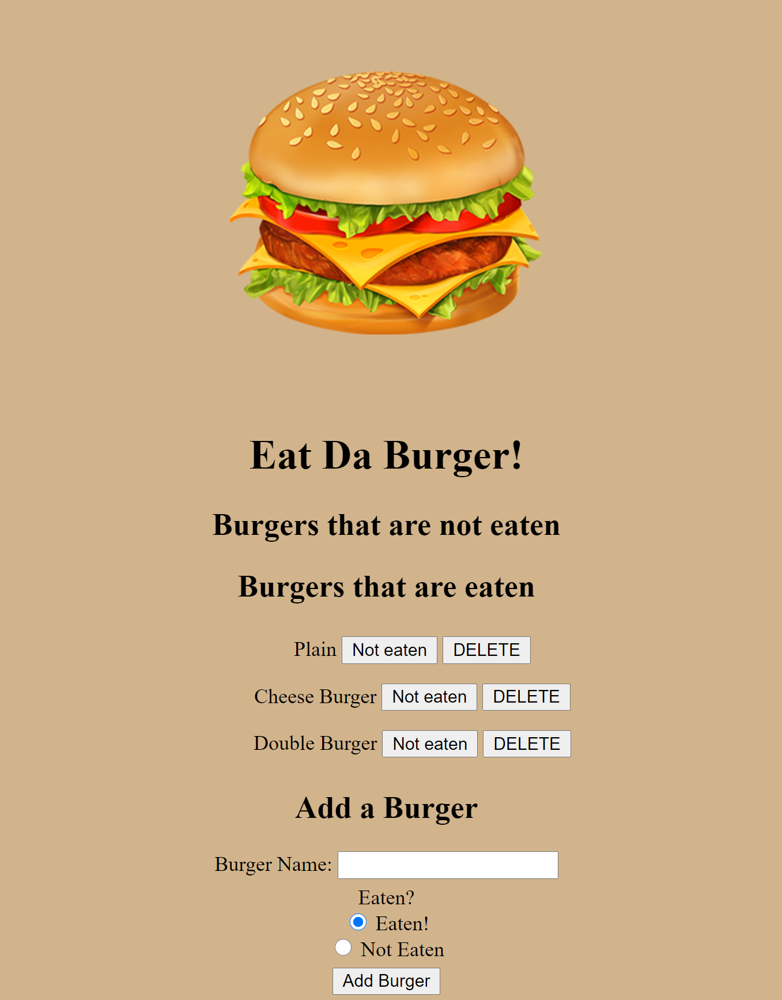
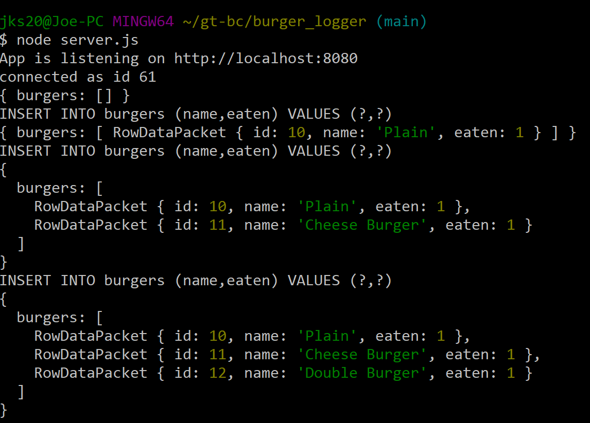

# Burger-Logger

## Purpose

To create an app that uses sql along with handlebars and javascript to create a webpage

## Method

The app uses handlebars for the webpage generation, sql for database feature, and javascript for backend features to connect handlebars and sql.

## Challenges

The biggest issue is understanding how handlebars work, cross referencing issues, and how the project is structured (in terms of how folders are arranged)

## Demonstration

## Conclusion/End Result

The app performs as expected. User can update the burger logger, consume the burger, change the status of consumed to not eaten, and delete the burger from the list

